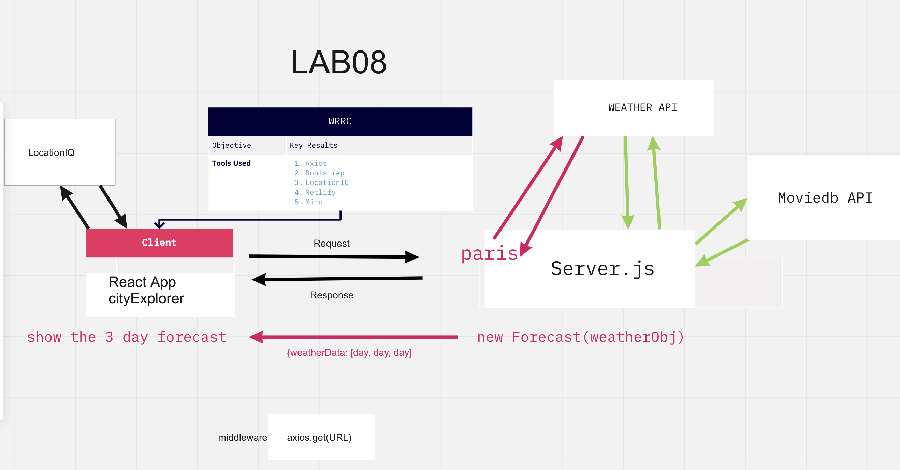
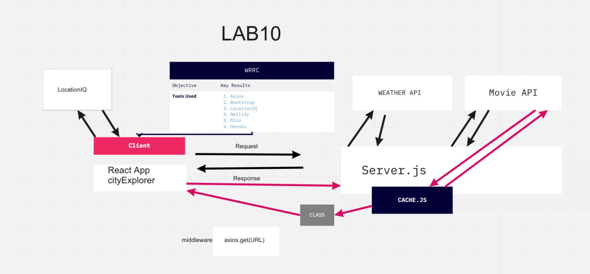

# Project Name: City Explorer-api

**Author**: Jeff Inman
**Version**: 1.0.0 (increment the patch/fix version number if you make more commits past your first submission)
**Netlify Link**: [The City Explorer](the-city-explorer.netlify.app)
**Project Trello Board**: [City Explorer Trello](https://trello.com/b/Xsm3RhAU/module-2-city-explorer)

## Overview
Custom API server, which will provide data for the City Explorer front-end application.

## Getting Started

## Architecture

## Change Log

## Credit and Collaborations
Accountability Partner: Angela D

Time Estimates
For each of the lab features, make an estimate of the time it will take you to complete the feature, and record your start and finish times for that feature:

Name of feature: ________________________________

Estimate of time needed to complete: _____

Start time: _____

Finish time: _____

Actual time needed to complete: _____